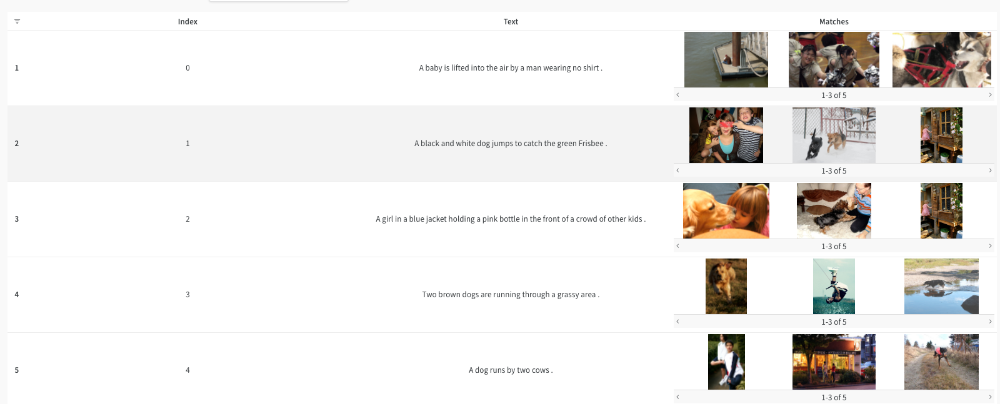

# <center>⚡️ Natural Language based Image Search 🐝</center>
<div align="center">
         &nbsp&nbsp&nbsp&nbsp&nbsp&nbsp&nbsp&nbsp&nbsp&nbsp&nbsp&nbsp&nbsp
         
</div>

This is a simple implementation of **Natural Language-based Image Search** inspired by the [CLIP](https://openai.com/blog/clip/) approach as proposed by the paper [**Learning Transferable Visual Models From Natural Language Supervision**](https://arxiv.org/abs/2103.00020) by OpenAI in [**PyTorch Lightning**](https://www.pytorchlightning.ai/). We also use [**Weights & Biases**](wandb.ai) for experiment tracking, visualizing results, comparing performance of different backbone models, hyperparameter optimization and to ensure reproducibility.

## 🚀 Getting Started
Getting started is incredibly easy! All you need is a system or colab with an enabled GPU! 

First up, clone the repository
```shell
git clone https://github.com/soumik12345/clip-lightning
cd clip-lightning
```

Now we can go ahead and install all the required pytorch packages

```shell
pip install -r requirements.txt
```

<!-- [Not needed] The script would work without W&B as well but we strongly recommend using it for the best experience. The `wandb` sdk will be installed by the previous command and now you can login to your account.

```shell
wandb login
``` -->

That's it! We can start training the model now. To make life easier we use the [LightningCLI](https://pytorch-lightning.readthedocs.io/en/stable/common/lightning_cli.html) for our [training script](./image_retrieval/cli.py).

```shell
python image_retrieval/cli.py fit \
    --data.dataset_name flickr8k \
    --data.artifact_id wandb/clip.lightning-image_retrieval/flickr-8k:latest \
    --data.train_batch_size 128 \
    --data.val_batch_size 128 \ 
    --data.max_length 200 \
    --model.image_encoder_alias resnet50 \
    --model.text_encoder_alias distilbert-base-uncased \ 
    --model.image_embedding_dims 2048 \
    --model.text_embedding_dims 768 \
    --model.projection_dims 256 \
    --trainer.precision 16 \ 
    --trainer.accelerator gpu \ 
    --trainer.max_epochs 20 \
    --trainer.log_every_n_steps 1 \
    --trainer.logger WandbLogger
```

This command will initialize a CLIP model with a **ResNet50** image backbone and a **distilbert-base-uncased** text backbone. It will download the flickr8k dataset logged as a W&B artifact, parse it and create dataloaders followed by training the model on this dataset. All the training and validation metrics are automaticallu logged to W&B. Some prompts from the validation set are also logged to your W&B dashboard along with predicted image matches at the end of every epoch.

## 📚 CLIP: Connecting Text and Images
CLIP (Contrastive Language–Image Pre-training) builds on a large body of work on zero-shot transfer, natural language supervision, and multimodal learning. CLIP pre-trains an image encoder and a text encoder to predict which images were paired with which texts in our dataset. This behavior turns CLIP into a zero-shot classifier. All of a dataset’s classes are converted into captions such as “a photo of a dog” followed by predicting the class of the caption in which CLIP estimates best pairs with a given image.

You can read more about CLIP [here](https://openai.com/blog/clip/) and [here](https://arxiv.org/abs/2103.00020)

## 💿 Dataset
This implementation of CLIP supports training on two datasets [Flickr8k](https://forms.illinois.edu/sec/1713398) which contains ~8K images with 5 captions for each image and [Flickr30k](https://aclanthology.org/Q14-1006/) which contains ~30K images with corresponding captions. Both the datasets were logged as W&B artifacts for easy accessibility. We use the [PyTorch Lightning DataModule](./image_retrieval/dataloaders/data_module.py) to handle all our data loading related needs including downloading the data, splitting it into training and validation sets and finally setting up the dataloaders.

## 🤖 Model
A CLIP model uses a text encoder and an image encoder. This repostiry supports pulling image models from [PyTorch Image Models](https://github.com/rwightman/pytorch-image-models) and transformer models from [huggingface transformers](https://github.com/huggingface/transformers). These are then encapsulated in a [LightningModule](./image_retrieval/models/clip_model.py) with appropriate callbacks for model training.

##  Visualizations
The robust integration that W&B has with PyTorch Lightning provides a great tool for visualizing and keep track of the model's progress. Apart from the training and validation losses, we also use W&B tables to log a few sentences from the validation set along with the predicted matching images!



By default, 20 sentences are logged with the top 5 matche🔬s but these can be changed with command line arguments.

```
python image_retrieval/cli.py fit \
    --data.dataset_name flickr8k \
    --data.artifact_id wandb/clip.lightning-image_retrieval/flickr-8k:latest \
    --data.train_batch_size 128 \
    --data.val_batch_size 128 \ 
    --data.max_length 200 \
    --model.image_encoder_alias resnet50 \
    --model.text_encoder_alias distilbert-base-uncased \ 
    --model.image_embedding_dims 2048 \
    --model.text_embedding_dims 768 \
    --model.projection_dims 256 \
    --trainer.precision 16 \ 
    --trainer.accelerator gpu \ 
    --trainer.max_epochs 20 \
    --trainer.log_every_n_steps 1 \
    --trainer.logger WandbLogger
    --log_prediction_callback.max_matches <max_matches>
    --log_prediction_callback.max_sentences <max_sentences>
```

## Conclusion
This implementatation of CLIP brings together PyTorch Lightning and W&B to create an easy-to-use training pipeline. More information on how to use the two frameworks is available [here](https://pytorch-lightning.readthedocs.io/en/stable/extensions/generated/pytorch_lightning.loggers.WandbLogger.html#pytorch_lightning.loggers.WandbLogger) and [here](https://docs.wandb.ai/guides/integrations/lightning). A [colab](https://wandb.me/lightning) is also available showcasing how to use the two together.